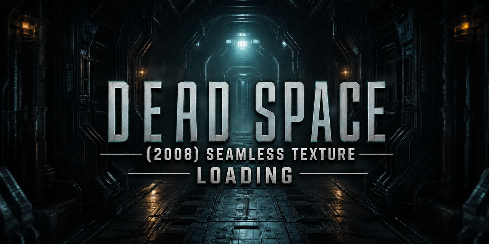

<p align="center">
  
</p>

# Dead Space (2008) Seamless Texture Compatibility


-c41e1f)

**A seamless texture-loading mod for the original Dead Space (2008) on PC.**
It lets the game load TexMod texture packs automatically at launch — no manual
TexMod setup, no renamed executables, no custom launch options. Install your
`.tpf` packs once; the launcher discovers, validates, and loads them every
time you press Play.

## What it does

- Discovers compatible TexMod `.tpf` packs on each launch and starts the game
  through TexMod, seamlessly.
- Validates pack contents before loading; corrupt or inaccessible packs stop
  the launch with a clear error instead of a silent failure.
- Your normal Play button (EA App, Steam, GOG, Vortex) remains the entry
  point.

## Install

1. Extract the release ZIP beside `Dead Space.exe`.
2. Put your TexMod `.tpf` texture packs in the `TexMod Packages` folder (or
   the game root).
3. Launch the game normally. On first run you will be asked before anything
   is downloaded; the original TexMod 0.9b is fetched only with your explicit
   consent and its hashes are verified.

See [`Documentation/README.md`](Documentation/README.md) for full player
installation and compatibility notes. TexMod, texture packs, and game files
are not included.

## Build from source

On Windows with Visual Studio C++ build tools and PowerShell:

```powershell
.\build.ps1
```

For prerequisites, exact build commands, output paths, and verification
steps, see [`BUILDING.md`](BUILDING.md). The root `build.ps1` compiles the
32-bit launcher and `dinput8.dll`; it does not recreate historical release
ZIPs byte-for-byte.

## Version archive

| Version | Local release package | Source evidence | Notes |
| --- | --- | --- | --- |
| [v1.0.0](versions/v1.0.0) | Original ZIP, unchanged | `Source/` was included inside that ZIP and is also extracted as `source-snapshot/` for browsing | No separate original source ZIP or checksum file was found. |
| [v2.0.0](versions/v2.0.0) | Original ZIP, unchanged | `Source/` was included inside that ZIP and is also extracted as `source-snapshot/` for browsing | No separate original source ZIP or checksum file was found. |
| [v2.1.0](versions/v2.1.0) | Locally retained five-file v2.1.0 ZIP, unchanged (originally released with 'Beta' in the filename) | Matching `release-final-2.1.0/Source` snapshot is copied as `source-snapshot/` | The earlier, larger upload ZIP was overwritten during local repackaging; its exact bytes and a separate original source ZIP are unavailable locally. |
| [v2.1.2](versions/v2.1.2) | Original install ZIP, unchanged | Original source ZIP, unchanged; its exact source files are browsable at the repository root | Latest complete version. |

There is no local v2.1.1 release package or source snapshot. Each version
folder has a newly generated `SHA256SUMS.txt` for the archived files —
backup metadata, not claimed original release files. No historical tags were
created: a version folder preserves each available source snapshot without
implying a reconstructed commit is an original historical release commit.

The v2.1.2 EA App launch and exit path was tested with the final release
binaries. Also tested working on the Steam release; ROG Ally was not retested for this version.

## Credits and licensing

Created by Rama2120.

MIT licensed — see [LICENSE](LICENSE).
